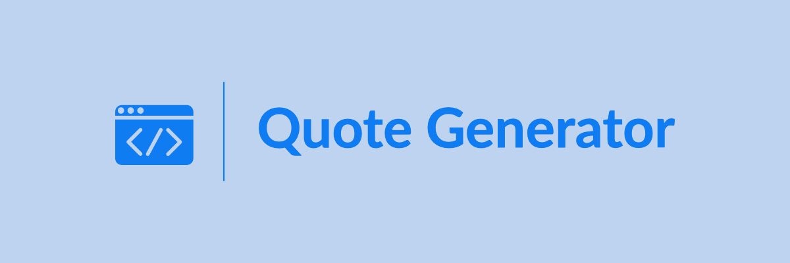

# Quote Generator

<div class="container">
  <div class="rubric"></div>
</div>

[]()
[]()
[]()


[]()
[]()
[]()
[]()
[]()
[]()


## Menu

- [Overview](#overview)
- [Documentation](#documentation)
- [How to use](#how-to-use)
- [Installation](#installation)
- [Requirements](#requirements)
- [Folder Structure](#folder-structure)
- [Author](#author)

## Overview

This project contains code for an API interface that generates random quotes. I created this project in order to improve and display my skills in data and code engineering.

**Future developments:**

- Adding to PyPI
- Using Docker
- Actual deployment on Heroku
- Using a different datasource.

## Documentation

The docs can be found on [quote-generator.readthedocs.io](https://quote-generator.readthedocs.io).

## How to Use

🚧🚧🚧 This will be updated once the application is running on a server. 🚧🚧🚧

## Installation

Clone the code using:

```shell
$ git@github.com:bryanlusse/quote_generator.git
```

Then create a virtual environment and install all requirements using:

```shell
$ pip install poetry
$ poetry config virtualenvs.create false
$ poetry lock
$ source .venv/bin/activate
$ poetry install
```

You can then run your own version of the quote_generator locally by running:

```shell
$ uvicorn quote_gen.api.main:app --reload --port 8000
```

or use the Dockerfile to create an image and run this image using:

```shell
$ docker build --tag 'quote_generator'
$ docker run quote_generator -p 8000:8000
```

You can then access the API interface on http://0.0.0.0:8000. Access the API docs on http://0.0.0.0:8000/docs.

## Requirements
Found in [pyproject.toml](https://github.com/bryanlusse/quote_generator/blob/master/pyproject.toml)

## Folder Structure
```
.
├── quote_gen                           # The main code lives here
├── pyproject.toml                      # Required packages
├── Makefile
└── README.md
```

All files can be inspected on Github.

## Author
Bryan Lusse.

Made with love.
